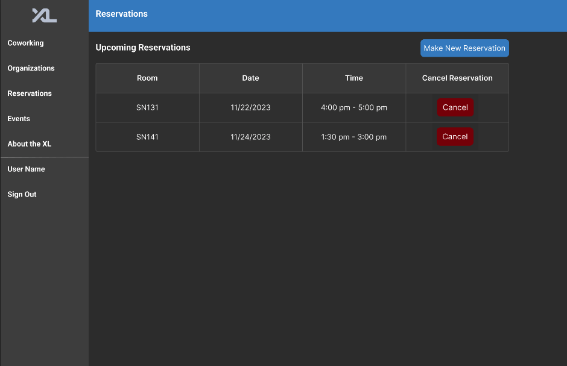

# Room Reservation Design Doc

This document is the design document for the room reservation feature that our team is trying to implement.

# Table of Contents

- [0. Title & Team](#0-title-and-team)
  - [Team Members](#room-reservation---final-team-b8)
- [1. Overview](#1-overview)
- [2. Key Personas](#2-key-personas)
  - [Sally Student](#sally-student)
  - [Alex Ambassador](#alex-ambassador)
  - [Rhonda Root](#rhonda-root)
- [3. User Stories](#3-user-stories)
  - [Sally Student](#sally-student-stories)
  - [Alex Ambassador](#alex-ambassador-stories)
  - [Rhonda Root](#rhonda-root-stories)
- [4. Wireframes / Mockups](#4-wireframes--mockups)
- [5. Technical Implementation Opportunities and Planning](#5-technical-implementation-opportunities-and-planning)
  - [5.1 What specific areaas we directly depend upon, extend, or integrate with?](#51-what-specific-areas-we-directly-depend-upon-extend-or-integrate-with)
  - [5.2 What page components, widgets do we expect in the frontend?](#52-what-planned-page-components-and-widgets-per-the-assigned-reading-do-you-anticipate-needing-in-your-features-frontend)
  - [5.3 What additional models, or changes to existing models, do you foresee needing?](#53-what-additional-models-or-changes-to-existing-models-do-you-foresee-needing-if-any)
  - [5.4 What API / Routes do you foresee modifying or needing to add?](#54-considering-your-most-frequently-used-and-critical-user-stories-what-api--routes-do-you-foresee-modifying-or-needing-to-add)
  - [5.5 What concerns exist for security and privacy of data?](#55-what-concerns-exist-for-security-and-privacy-of-data-should-the-capabilities-you-are-implementing-be-specific-to-only-certaain-users-or-roles)

# 0. Title and Team

## Room Reservation - Final Team B8

- [Aarjav Jain](https://github.com/aarjavjain2002)
- [John Schachte](https://github.com/JohnSchachte)
- [Nick Wherthey](https://github.com/wherthey)
- [Yuvraj Jain](https://github.com/yuvrajjain2003)

# 1. Overview:

Due to the constant overcrowding of Davis and the Undergraduate library, especially during exams, it's difficult for students to find group study spaces. We aim to offer Computer Science majors the same room reservation options available to other departments. As CSXL grows in popularity, **we want to provide CS students with the chance to book study rooms in Sitterson.**

# 2. Key Personas

## Sally Student

- Sally is an undergraduate computer science major at UNC Chapel Hill.
- Sally needs to reserve a room in Sitterson to study with her friends.

## Alex Ambassador

- Alex is an ambassador for CSXL.
- Alex needs to cancel reservations in case of no shows.

## Rhonda Root

- Rhonda is the manager for CSXL and has root access to the entire website.
- Rhonda needs to be able to view stats for the usage of the rooms.

# 3. User Stories

## Sally Student Stories

- **Story A:** As Sally Student, I want to view which rooms are available to be reserved, and make a reservation for a given date and time if the room is available.
- **Story B:** As Sally Student, I should be able to cancel a reservation if I am, for any reason, not able to honor the reservation.

## Alex Ambassador Stories

- **Story C:** As Alex Ambassador, I want to cancel reservations for a room if no one shows up to honor their reservation. I should also be able to view the name / PID of the person who reserved any given room.

## Rhonda Root Stories

- **Story D:** As Rhonda Root, I want to view the statistics to track the usage of the different rooms throughout Sitterson.
- **Story E:** As Rhonda Root, I should be able to add / remove rooms which are reservable.

# 4. Wireframes / Mockups

The following wireframe has been designed in Figma, using the exact color schemes and object placement as the CSXL website, allowing for seamless integration of our new features into the official website.

## Reservations Page

The CSXL website will have a Reservations tab in the menu along the left. Upon clicking, this will lead to a Reservations page as displayed. The page contains the following:

- A table that displays the upcoming reservations that the user has made. It will display the room, the date, and the time for which the user has made the reservation.
- For each reservation, there is also a Cancel button that will cancel the respective reservation and clear the time slot for other users to book.
- There is a Make New Reservation button that will direct users to another page in order to make a new reservation.

## Make New Reservation

The Make New Reservations page displays a grid, with the rooms along the rows and the time slots during the XL open hours along the columns.

The user can click the drop down list to select a specific date for which they need to check availability. The grid will show reserved room slots as Red and open slots as the default Gray.

To make a selection, users can click on cells in the grid for the respective room and time duration that they need. This will highlight the cells green.

The user can click Confirm Reservation in order to confirm their highlighted reservation.

# 5. Technical Implementation Opportunities and Planning

### 5.1 What specific areas we directly depend upon, extend, or integrate with?

- frontend/src/app/navigation
  - Add a navigation tab that directs user to a room booking route.
- frontend/src/app/about
  - Add text explaining the room booking on this existing route.
- backend/entities/room_entity
  - Initially two relational tables, two entities, and two pydantic models.

### 5.2 What planned page components and widgets, per the assigned reading, do you anticipate needing in your feature’s frontend?

- Show upcoming reservations for User
  - This is a page component that will display a users upcoming events.
- Show upcoming reservations for all Users
  - This will be for ambassadors/admins roles.
- Widget for upcoming reservations
  - This widget will be shared in both the upcoming reservation for User and upcoming reservation
    for Users page components.
  - We are making this widget so we can easily move upcoming reservations around our project.
- Making Reservation
  - This will be a page component.
  - Its functionality will be displaying open timeslots and allowing users to book them.

### 5.3 What additional models, or changes to existing models, do you foresee needing (if any)?

- We need to include these models so our data can persist and we will know what rooms are in use or what rooms are open. An example of when we would use one of these models would be when a student is trying to make a reservation.
- room_reservation.
  - Atomic time slot (Int)
  - Date (Date)
  - Room Number (Int)
  - Capacity (Int)
  - isReserved (Boolean)
  - user_id (Int)
- room
  - room_number (Int)
  - id (Int)
  - start_of_operations (Int)
  - end_of_operations (Int)
  - reservable (Boolean)

### 5.4 Considering your most-frequently used and critical user stories, what API / Routes do you foresee modifying or needing to add?

- `get`: We will include a route to display the upcoming reservations for a user. We will also use a `get` for retreiving all time slots for the rooms.
- `post`: We will include a post for when a user wants to make a room reservation.
- `delete`: We will include a delete route for if a user wants to delete an upcoming reservation.

### 5.5 What concerns exist for security and privacy of data? Should the capabilities you are implementing be specific to only certaain users or roles?

- The feature to view all upcoming reservations and reservation statistics can only be viewed by admins and ambassadors.
- Ambassadors should be able to reserve a room the same as a student.
- One student should not be able to cancel the reservation of another student, that is reserved for the ambassadors.
- SQL injection attacks, if we are getting tables from routes when we implement, we could be prone to attacks.
