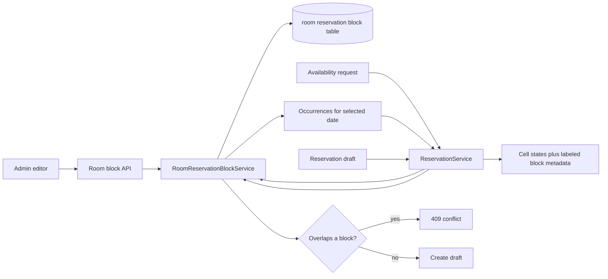

# Persisted Room Reservation Block Policy Plan

Status: Implemented in a five-PR stack; pending review

## Objective

Replace the former hard-coded room blocks in `backend/services/coworking/policy.py` with an editable, database-backed policy. Authorized staff can create standing weekly blocks for a room, give each block a label such as `COMP211 Check-off`, set the dates during which it applies, edit it, and remove or disable it without a code deployment.

The blocked-time policy should be authoritative: it must affect the availability table and reject a room-reservation request sent directly to the API, not only disable cells in the browser.

## Baseline State

The implementation replaced a baseline with four important characteristics:

1. `OH_HOURS` in `backend/services/coworking/policy.py` is a nested dictionary keyed by Python weekday number and room ID. Each value is an unlabeled `(start_time, end_time)` tuple.
2. `PolicyService.office_hours(date)` selects one weekday from that dictionary. `ReservationService._transform_date_map_for_officehours(...)` converts its tuples into gray `UNAVAILABLE` cells in the room-reservation matrix.
3. The matrix returned by `GET /api/coworking/room-reservation/` contains integer cell states only. It cannot explain why a cell is unavailable or carry a label.
4. `ReservationService.draft_reservation(...)` checks the database for conflicting user reservations, but does not check `OH_HOURS`. A caller can therefore bypass a policy block by posting a reservation directly to the API.

The database-backed `OperatingHoursService` is a useful CRUD and permission precedent. The academic office-hours recurrence implementation is less suitable: it materializes every occurrence as an event. Room blocks are simple weekly policy rules and can be expanded for a requested date at query time, avoiding an indefinitely growing occurrence table.

The codebase currently stores and compares naive local datetimes after converting API timestamps to `America/New_York`. A persisted weekly rule should therefore store local wall-clock times and use the same timezone convention at its API boundary.

## Implementation Progress

| Stack layer | Delivered |
| ----------- | --------- |
| 1. Models and migration | Pydantic models, SQLAlchemy-compatible schema migration, constraints, frozen legacy-data backfill, and model/migration tests |
| 2. Entity | ORM entity registration, model conversion, and PostgreSQL persistence round-trip tests |
| 3. Services and API | Permission-scoped CRUD, conflict validation, room locking, direct-draft enforcement, labeled availability metadata, and service/API tests |
| 4. Frontend | Typed CRUD service, guarded Material admin editor, admin-gear entry point, labeled tooltips/ARIA descriptions, strict build, and lint |
| 5. Final cutover | Removal of `OH_HOURS`, representative reset data, client range validation, documentation reconciliation, and full regression verification |

The first version deliberately omits audit-user foreign keys, advanced list filters, partial-update payloads, and a dedicated frontend unit-test runner. Those additions do not affect the core editing or enforcement path and can be introduced when the repository adopts them consistently. The frontend is verified with the repository's configured production build and lint targets.

## Goals

- Persist one weekly room block with a room, label, weekday, start/end time, and effective date range.
- Support create, list, edit, enable/disable, and delete operations for authorized staff.
- Prevent overlapping enabled block rules for the same room.
- Prevent a new or edited block from silently invalidating an active room reservation.
- Prevent direct reservation API calls from booking a blocked time.
- Preserve the existing integer availability matrix for compatibility while adding label metadata.
- Make labels visible and accessible in the room-reservation UI.
- Migrate the intended long-lived entries from `OH_HOURS` before removing the constant.

## Non-goals for the First Version

- Creating fake `ReservationEntity` rows owned by a service account. Policy blocks should not check in, consume a student's weekly quota, or participate in reservation state transitions.
- General calendar recurrence such as “the third Tuesday,” exception dates, or arbitrary recurrence rules.
- Blocks spanning midnight. Represent these as two rules on adjacent weekdays.
- A bulk multi-room or multi-weekday editor. Multiple rules may share a label.
- Replacing the existing 30-minute room-reservation grid.

## Recommended Domain Model

Use the name **room reservation block** in code and API paths. Avoid calling the new entity `OfficeHours`; that term already names the academic office-hours feature and the coworking operating-hours feature.

Create a `coworking__room_reservation_block` table and a corresponding `RoomReservationBlockEntity`:

| Column          | Type              | Rules                                                                      |
| --------------- | ----------------- | -------------------------------------------------------------------------- |
| `id`            | integer           | Primary key, autoincrementing                                              |
| `room_id`       | string            | Non-null foreign key to `room.id`; restrict room deletion while referenced |
| `label`         | varchar(120)      | Non-empty after trimming                                                   |
| `weekday`       | small integer     | Python convention: Monday `0` through Sunday `6`                           |
| `start_time`    | time              | Local `America/New_York` wall-clock time                                   |
| `end_time`      | time              | Local wall-clock time; strictly after `start_time`                         |
| `starts_on`     | date              | First date on which the weekly rule may apply                              |
| `ends_on`       | date, nullable    | Inclusive last date; `NULL` means no scheduled end                         |
| `enabled`       | boolean           | Defaults to `true`; disabled rules do not block reservations               |
| `created_at`    | timestamp         | Audit timestamp                                                            |
| `updated_at`    | timestamp         | Updated automatically                                                      |

Add database checks for:

- `weekday BETWEEN 0 AND 6`;
- `start_time < end_time`;
- `ends_on IS NULL OR ends_on >= starts_on`;
- start and end seconds are zero and minutes are either `0` or `30`, matching the current grid; and
- `length(trim(label)) > 0`.

Add an index beginning with `(room_id, weekday, starts_on)` and including `ends_on` for the schedule and conflict queries. A normal unique constraint cannot prevent interval overlap. The service-level overlap check described below should run while holding a lock on the room row. A later PostgreSQL exclusion constraint is possible, but it would require representing wall-clock times as an integer or range expression and is not necessary for the first migration.

Use separate Pydantic models:

- `NewRoomReservationBlock` for create payloads;
- `RoomReservationBlock` for persisted rules;
- `RoomReservationBlockOccurrence` for a rule expanded onto one calendar date; and
- optionally `RoomReservationBlockUpdate` if partial updates are preferred over replacing a rule.

An occurrence should contain `id`, `room_id`, `label`, `start`, and `end` as datetimes. API clients should not have to combine a weekday and wall-clock time themselves.

### Recurrence Semantics

A rule applies to a date when all of the following are true:

- `enabled` is true;
- `date.weekday() == weekday`;
- `starts_on <= date`; and
- `ends_on` is null or `date <= ends_on`.

Treat intervals as half-open: `[start, end)`. Thus, 11:30 a.m.–2:00 p.m. and 2:00–3:00 p.m. are adjacent and do not conflict.

Two rules conflict when they have the same room and weekday, their effective date ranges overlap, and their time ranges overlap. The rule being updated must be excluded from its own conflict query.

## Proposed Request Flow



## Backend Implementation

### 1. Persistence and Registration

Add:

- `backend/entities/coworking/room_reservation_block_entity.py`;
- `backend/models/coworking/room_reservation_block.py`;
- `backend/services/coworking/room_reservation_block.py`;
- `backend/api/coworking/room_reservation_block.py`; and
- an Alembic migration for the table, indexes, constraints, and initial data.

Export the new classes from the coworking `__init__.py` modules. Import the entity from `backend/entities/__init__.py` so Alembic and test metadata see it. Register the API router in `backend/main.py`.

### 2. Service Responsibilities

`RoomReservationBlockService` should provide:

- `get_by_id(id)`;
- `list_rules(room_id=None, include_disabled=False)` for the management UI;
- `schedule(date, room_id=None)` returning expanded occurrences;
- `find_overlaps(room_id, start, end, exclude_id=None)` for reservation enforcement;
- `create(subject, payload)`;
- `update(subject, id, payload)`; and
- `delete(subject, id)`.

Create and update should validate that the room exists and is reservable. They should reject overlapping block rules and return a structured conflict response identifying the conflicting rule.

Create and update should also query active room reservations (`DRAFT`, `CONFIRMED`, and `CHECKED_IN`) that would occur under the proposed rule. If any exist, reject the operation with conflict details. Do not silently override or cancel a student's reservation in the first version. An explicit administrative override workflow can be designed later if needed.

For rules without `ends_on`, the reservation-conflict query only needs to examine persisted future reservations; there is no need to generate an infinite set of dates. Filter candidate reservations by `room_id`, state, date/weekday, and time overlap.

### 3. Transaction and Race Safety

Conflict checks in two tables can race. Before either creating a room reservation draft or mutating a room block, select the corresponding `RoomEntity` row `FOR UPDATE` and hold that lock until commit. Always acquire this lock before querying conflicts. This serializes policy changes and bookings for one room without blocking unrelated rooms, and also closes the existing race between two simultaneous room draft requests.

The draft path should compare the final bounded reservation interval—not merely the original request—to both:

- active `ReservationEntity` rows for the room; and
- enabled room-block occurrences.

If a block overlaps, raise a dedicated conflict exception mapped to HTTP `409`, with a safe message such as `SN147 is blocked for COMP211 Check-off from 11:30 AM to 5:00 PM.` Validation remains `422`, missing resources `404`, and permission failures `403`.

### 4. Availability Integration

Inject `RoomReservationBlockService` into `ReservationService`. Replace `PolicyService.office_hours(date)` and `_transform_date_map_for_officehours(...)` with a block-oriented method that:

1. loads occurrences once for the requested date;
2. clips them to that day's operating-hours window;
3. marks the affected matrix cells `RoomState.UNAVAILABLE`; and
4. returns occurrence metadata alongside the matrix.

Extend `ReservationMapDetails` with:

```python
room_reservation_blocks: list[RoomReservationBlockOccurrence] = []
```

Keep blocked cells at integer state `3` initially so existing clients remain compatible. The occurrence list supplies the missing explanation without forcing a matrix protocol redesign.

`PolicyService` should retain unrelated duration/window policies. Remove only `OH_HOURS`, the weekday constants if no longer used, and `office_hours(...)`. Consider renaming any remaining “office hours” helper names to “room blocks” in the same change so the academic and coworking concepts are not conflated.

### 5. API and Permissions

Recommended management routes:

| Method   | Route                                         | Purpose                   |
| -------- | --------------------------------------------- | ------------------------- |
| `GET`    | `/api/coworking/room-reservation-blocks`      | List/filter rules         |
| `GET`    | `/api/coworking/room-reservation-blocks/{id}` | Load one rule for editing |
| `POST`   | `/api/coworking/room-reservation-blocks`      | Create a rule             |
| `PUT`    | `/api/coworking/room-reservation-blocks/{id}` | Replace/edit a rule       |
| `DELETE` | `/api/coworking/room-reservation-blocks/{id}` | Delete a rule             |

Use room-scoped permissions:

- actions: `coworking.room_reservation_blocks.read`, `.create`, `.update`, and `.delete`;
- resource: `room/{room_id}`.

An administrator who manages every reservable room can receive `coworking.room_reservation_blocks.*` on `room/*`. The list endpoint can initially require the wildcard read permission; room-filtered access can later support narrower roles. Add these actions to `docs/admin_permissions.md` when implemented.

The existing authenticated availability endpoint may return occurrence labels because they are intended as user-facing explanations. If labels are later allowed to contain private operational notes, add a separate public label rather than hiding availability reasons from users.

## Administration UI

Add a permission-guarded page at `/coworking/admin/room-reservation-blocks`. Keeping it in the coworking module makes the feature's ownership clearer than placing it in the academic room editor.

The first-version page contains:

- a table sorted by room, weekday, and start time;
- columns for label, room, weekday, time, effective dates, and enabled state;
- create, edit, enable/disable, and delete actions; and
- a reactive form using the existing room list endpoint for room selection.

Client-side validators mirror the backend's required label, half-hour alignment, end-after-start, and valid date range checks. Backend validation remains authoritative. On HTTP `409`, the editor shows the backend's specific conflict message in a snackbar.

Expose the page through the admin gear on the room-reservation page when the user has `coworking.room_reservation_blocks.read` on `room/*`. This follows the existing permission guard and admin navigation patterns without adding the feature to the broad site-admin account console.

In the student reservation table:

- map each blocked cell to its occurrence metadata;
- show the label and time range in a Material tooltip;
- add an `aria-label` containing the room, time, and reason; and
- update the legend text from only `Unavailable` to clarify that standing reservations are included.

## Migration and Cutover

1. Inventory `OH_HOURS` at implementation time and classify every row as long-lived or temporary.
2. Create the schema migration. Freeze backfill values directly in the migration; do not import the mutable Python constant from application code.
3. Backfill long-lived rules with a deployment-date `starts_on` value and `ends_on = NULL`, or with an explicit term end when known.
4. Treat the current `# comp211 checkoff` entries as temporary. If the migration is deployed while they are still relevant, backfill them with the bounded week of August 31 through September 4, 2026; otherwise omit them. Never migrate those comments into indefinite rules.
5. Deploy the database-backed service and API, switch availability and draft enforcement to it, and compare the selected-date matrix against the pre-cutover behavior in tests.
6. Remove `OH_HOURS` only after the backfill is verified. The downgrade path can drop the new table; the prior application version still contains its hard-coded fallback.
7. Add representative room-block records to testing/demo reset data so local development and integration tests exercise the feature.

No dual-write period is necessary because the old policy is not mutable. Avoid reading both sources simultaneously, which would complicate labels and conflict reporting.

## Test Plan

### Backend

- Model validation: empty label, invalid weekday, reversed/equal times, non-half-hour time, and invalid date range.
- Service schedule: correct weekday, inclusive start/end dates, disabled rule, indefinite rule, and timezone conversion.
- Block conflicts: exact overlap, containment, overlapping effective dates, non-overlapping effective dates, different rooms, different weekdays, and allowed adjacent intervals.
- Reservation conflicts: create/update rejects active future bookings but ignores cancelled and checked-out bookings.
- Draft enforcement: direct API requests overlapping a rule return `409`; adjacent requests succeed.
- Permissions: list/create/update/delete enforce the documented action and room resource.
- Persistence: create, reload in a new session, update, disable, and delete.
- Availability: blocked cells remain state `3`, clipping at operating-hours boundaries is correct, and occurrence labels are returned.
- Concurrency: simultaneous block creation and reservation drafting for the same room cannot both commit when they overlap.
- Migration: backfilled rules produce the same matrix as the intended non-temporary `OH_HOURS` entries.

### Frontend

- Service parsing of date/time occurrence fields.
- Form validation and create/edit payloads.
- Permission guard and admin-gear visibility.
- Conflict response rendering.
- Blocked-cell tooltip and accessible label.
- Regression coverage for selection behavior and all existing cell states.

## Five-PR Delivery Sequence

1. **Models and migration:** add validated models, the schema migration, frozen backfill inventory, and basic tests.
2. **Entity:** add ORM persistence, registration, conversion, and round-trip tests.
3. **Services and API:** add CRUD, permissions, conflicts, locking, draft enforcement, availability metadata, and backend tests.
4. **Frontend:** add the admin editor and labeled student availability experience, verified by production build and lint.
5. **Final tweaks and cutover:** remove the legacy constant, add reset data and migration coverage, reconcile documentation, and run full regressions.

## Acceptance Criteria

- An authorized administrator can create `COMP211 Check-off` for SN147 on a weekday and date range, reload the application, and see the same rule.
- The selected occurrences appear unavailable and labeled in the room-reservation UI.
- Editing, disabling, ending, or deleting the rule changes future availability without a deployment.
- Overlapping block rules are rejected; touching endpoints are allowed.
- A direct reservation API call cannot book an enabled block.
- A block cannot be introduced over an existing active reservation without an explicit future override workflow.
- Unrelated rooms can still be booked concurrently.
- Existing non-temporary policy blocks survive the cutover with equivalent behavior.

## Initial Policy Decisions

Labels are shown to authenticated reservation users, indefinite rules are allowed, and management is initially limited to users with the explicit room-block permissions (root administrators in the supplied data). Ambassadors are not granted management by default, and blocks are not forced to end with an academic term.
