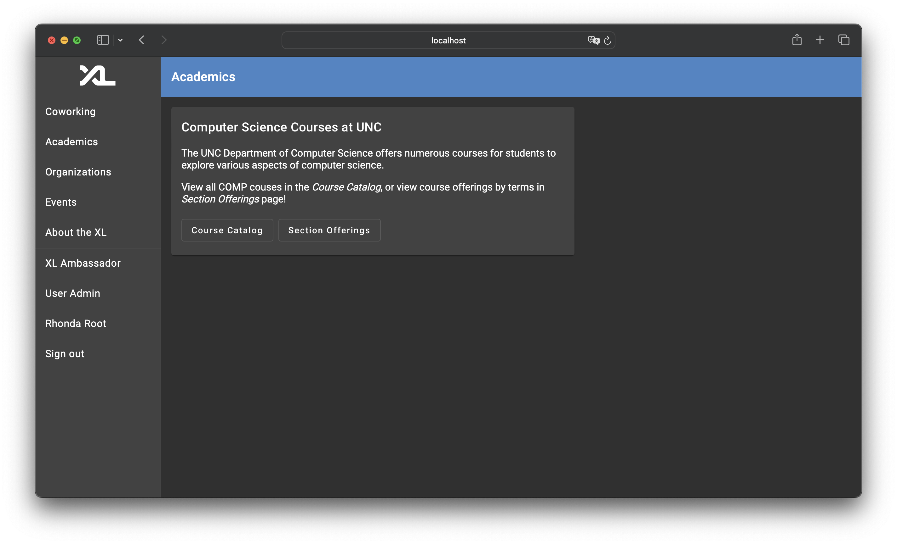
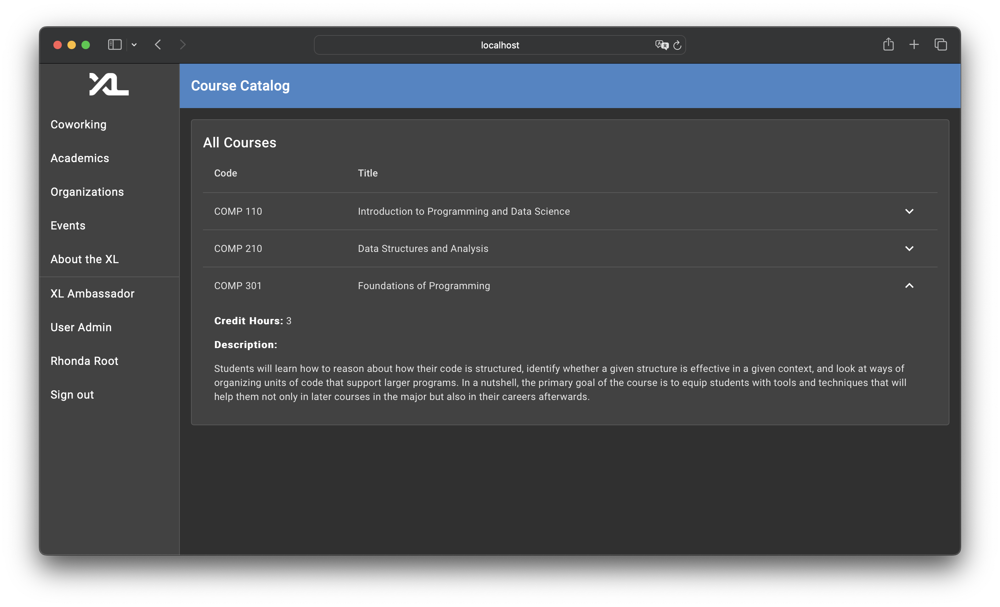
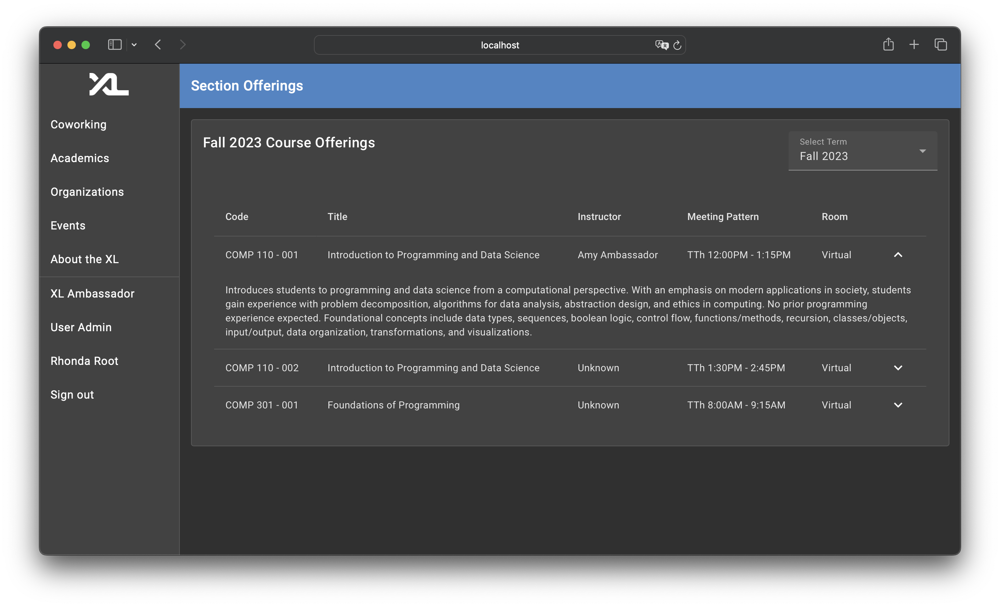
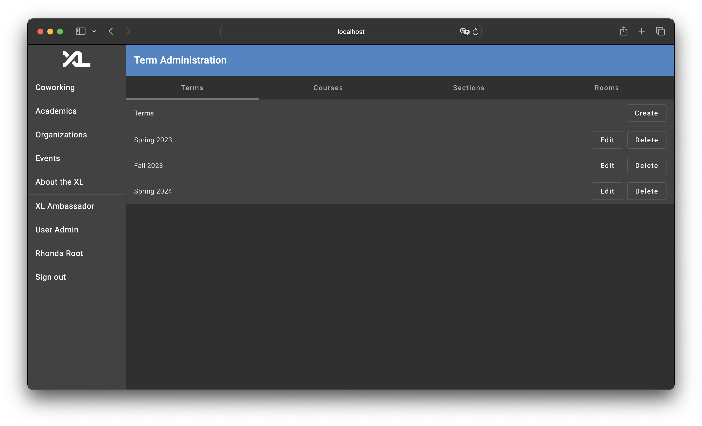
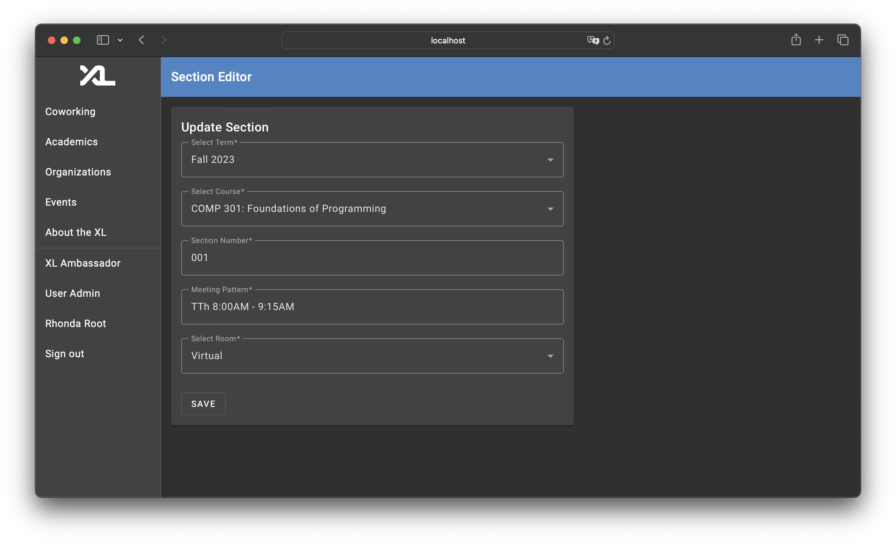

# Academics Feature Technical Specification

> Written by [Ajay Gandecha](https://github.com/ajaygandecha) for the CSXL Web Application.  _Last Updated: 12/24/2023_

This document contains the technical specifications for the Academics feature of the CSXL web application. This feature adds _5_ new database tables, _25_ new API routes, and _12_ new frontend components to the application.

The Academics Feature adds UNC course data to the CSXL web application. The web application can now store data on UNC courses, course offerings / sections for each courses, and terms. Section data also stores instructors and TAs for a course, as well as lecture and office hour rooms.

All visitors to the CSXL page are able to view a _COMP Course Catalog_ to see all of the courses that the UNC Computer Sciende department offers, as well as a _Section Offerings_ page where students can view course sections being offered for various terms. Course data is modifiable to the CSXL web page administrator.

## Frontend Features

The admin features add _12_ new Angular components, all at the `/academics` route.

### User Features

The following pages have been added and are available for all users of the CSXL site. These pages are ultimately powered by new Angular service functions connected to new backend APIs.

#### Academics Home

The home page for the new Academics feature is available on the side navigation toolbar at `/academics`. The home page contains links to both the _course catalog_ and the _section offerings_ page.

In the future, this page will be heavily extended to add personalized academics features for users of the CSXL web app. For now, this page will remain static and exist merely for informational and navigational purposes.

#### Course Catalog

The course catalog page serves as the main hub for students to learn more about COMP courses at UNC. The page exists at the `/academics/catalog` route. The course page shows the courses available in the backend. Right now, the course page shows this data in a simple table. Users can click on courses to see a dropdown to learn more about a course's _credit hours_ and _description_.

In the future, when more courses outside of just COMP courses are added here, this page will include a dropdown in the top right that allows users to switch the course subject they look for courses on.

#### Section Offerings

The section offerings page serves as the main hub for students to view offerings of COMP courses by semester / term. The page exists at the `/academics/offerings` route. The section page shows this data in a table. Users can click on courses to see a dropdown to learn more about a course. There is also a dropdown in the top right that allows users to view course offerings based on all of the semesters / terms saved in the database.

In the future, when more courses outside of just COMP courses are added here, this page will include another dropdown in the top right that allows users to switch the course subject they look for courses on.

### Admin Features

In order to support admin features for term, course, and section data, many components were added. In addition, the existing `NavigationComponent` was modified to enable better navigation to admin pages.

#### Gear Icon to Access Admin Features

The Academics feature adds a gear icon to the top right of the Navigation toolbar exposing the admin page to users with the correct permissions. This gear icon links to the admin page.

To implement this, a new frontend service called the `NagivationAdminGearService` manages when to show the gear. Upon redirect, the navigation component clears gear data, and on initialization, components use the `NagivationAdminGearService.showAdminGear(permissionAction: string, permissionResource: string, tooltip: string, targetUrl: string)` to conditionally show the gear on the navigation bar if the permissions are met.

This feature can easily be added throughout the CSXL application. For now, the functionality is only used in the academics admin features.

#### Academics Admin Tabbed Page

Once the admin clicks on the gear icon shown previously, they are redirected to the Acadmics Admin page. This page contains four subcomponents accessible by tags - admin pages to modify _terms_, _courses_, _sections_, and _rooms_ in the backend database.

All of the pages look similar - they display a table with current data and enable creating, editing, and deleting items. All four pages implement their own versions of `RxObject` to ensure that the view updates automatically when data is removed from the table.

#### Academics Admin Editor Pages

Upon creation or modification of a new item, the admin user is redirected to an editor for the respective data. If editing an item, the editor page is automatically preopopulated to include previous data.

### Conclusion

In total, the following components have been added:

| Name                     | Route                         | Description                                              |
| ------------------------ | ----------------------------- | -------------------------------------------------------- |
| **Academics Home**       | `/academics`                  | Main home page for the academics feature.                |
| **Course Catalog**       | `/academics/catalog`          | Displays all COMP courses and their details.             |
| **Section Offerings**    | `/academics/offerings`        | Displays offerings for COMP courses by term.             |
| **Academics Admin Home** | `/academics/admin`            | Exposes the academics admin features.                    |
| **Term Admin**           | `/academics/admin/term`       | Shows all term data and exposes CRUD functionality.      |
| **Course Admin**         | `/academics/admin/course`     | Shows all course data and exposes CRUD functionality.    |
| **Section Admin**        | `/academics/admin/section`    | Shows all section data and exposes CRUD functionality.   |
| **Room Admin**           | `/academics/admin/room`       | Shows all room data and exposes CRUD functionality.      |
| **Term Editor**          | `/academics/term/edit/:id`    | Form to show when terms are to be created and edited.    |
| **Course Editor**        | `/academics/course/edit/:id`  | Form to show when courses are to be created and edited.  |
| **Section Editor**       | `/academics/section/edit/:id` | Form to show when sections are to be created and edited. |
| **Room Editor**          | `/academics/room/edit/:id`    | Form to show when room are to be created and edited.     |
