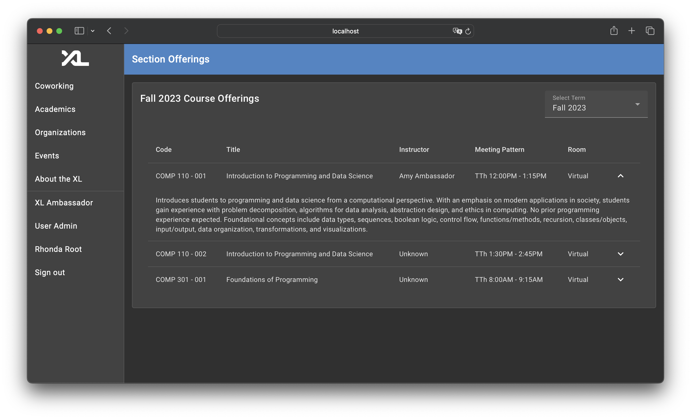
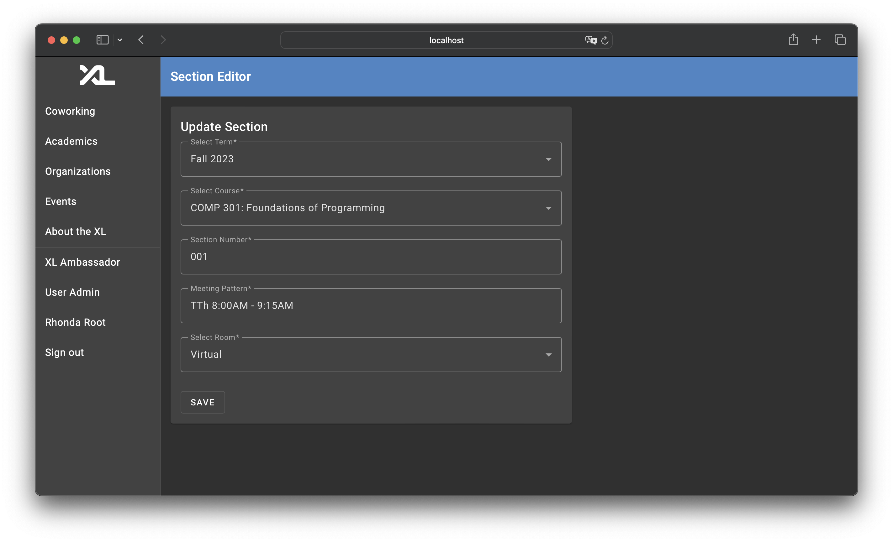

# Academics Feature Technical Specification

> [David Foss](https://github.com/fossinating), [Ella Gonzales](https://github.com/ellagonzales), [Tobenna Okoli](https://github.com/TJOKOLI17), [Francine Wei](https://github.com/francinew6) > _Last Updated: 05/03/2025_

This document outlines the technical specifications for the Open Hours Editor feature of the CSXL web application. This feature adds functionality to manage open hours directly through a user-friendly interface, improving administrative efficiency. The project introduces several new frontend components and utilizes existing API routes with minimal modifications to achieve its goals.

## Table of Contents

- [Frontend Features](#FrontendFeatures)
  - [User Features](#UserFeatures)
    - [Operating Hours Calendar](#OperatingHoursCalendar)
  - [Admin Features](#AdminFeatures)
    - [Gear Icon to Access Admin Features](#GearIcontoAccessAdminFeatures)
    - [Academics Admin Tabbed Page](#AcademicsAdminTabbedPage)
    - [Academics Admin Editor Pages](#AcademicsAdminEditorPages)
  - [Conclusion](#Conclusion)
- [Backend Design and Implementation](#BackendDesignandImplementation)
  - [Entity Design](#EntityDesign)
  - [Pydantic Model Implementation](#PydanticModelImplementation)
  - [API Implementation](#APIImplementation)
  - [Permission Summary](#PermissionSummary)
  - [Testing](#Testing)

## Frontend Features<a name='FrontendFeatures'></a>

The frontend features add _7_ new Angular components.

### User Features<a name='UserFeatures'></a>

The following feature has been added and is available for all users of the CSXL site. This feature is ultimately powered by new Angular service functions connected to new backend APIs.

#### Operating Hours Calendar<a name='OperatingHoursCalendar'></a>


The home page for the new Academics feature is available on the side navigation toolbar at `/academics`. The home page contains links to both the _course catalog_ and the _section offerings_ page.

In the future, this page will be heavily extended to add personalized academics features for users of the CSXL web app. For now, this page will remain static and exist merely for informational and navigational purposes.

#### Course Catalog<a name='CourseCatalog'></a>


The course catalog page serves as the main hub for students to learn more about COMP courses at UNC. The page exists at the `/academics/catalog` route. The course page shows the courses available in the backend. Right now, the course page shows this data in a simple table. Users can click on courses to see a dropdown to learn more about a course's _credit hours_ and _description_.

In the future, when more courses outside of just COMP courses are added here, this page will include a dropdown in the top right that allows users to switch the course subject they look for courses on.

#### Section Offerings<a name='SectionOfferings'></a>



The section offerings page serves as the main hub for students to view offerings of COMP courses by semester / term. The page exists at the `/academics/offerings` route. The section page shows this data in a table. Users can click on courses to see a dropdown to learn more about a course. There is also a dropdown in the top right that allows users to view course offerings based on all of the semesters / terms saved in the database.

In the future, when more courses outside of just COMP courses are added here, this page will include another dropdown in the top right that allows users to switch the course subject they look for courses on.

### Admin Features<a name='AdminFeatures'></a>

In order to support admin features for term, course, and section data, many components were added. In addition, the existing `NavigationComponent` was modified to enable better navigation to admin pages.

#### Gear Icon to Access Admin Features<a name='GearIcontoAccessAdminFeatures'></a>


The Academics feature adds a gear icon to the top right of the Navigation toolbar exposing the admin page to users with the correct permissions. This gear icon links to the admin page.

To implement this, a new frontend service called the `NagivationAdminGearService` manages when to show the gear. Upon redirect, the navigation component clears gear data, and on initialization, components use the `NagivationAdminGearService.showAdminGear(permissionAction: string, permissionResource: string, tooltip: string, targetUrl: string)` to conditionally show the gear on the navigation bar if the permissions are met.

This feature can easily be added throughout the CSXL application. For now, the functionality is only used in the academics admin features.

#### Academics Admin Tabbed Page<a name='AcademicsAdminTabbedPage'></a>


Once the admin clicks on the gear icon shown previously, they are redirected to the Acadmics Admin page. This page contains four subcomponents accessible by tags - admin pages to modify _terms_, _courses_, _sections_, and _rooms_ in the backend database.

All of the pages look similar - they display a table with current data and enable creating, editing, and deleting items. All four pages implement their own versions of `RxObject` to ensure that the view updates automatically when data is removed from the table.

#### Academics Admin Editor Pages<a name='AcademicsAdminEditorPages'></a>



Upon creation or modification of a new item, the admin user is redirected to an editor for the respective data. If editing an item, the editor page is automatically preopopulated to include previous data.

### Conclusion<a name='Conclusion'></a>

In total, the following components have been added:

| Name                              | Route                                                                | Description                                                               |
| --------------------------------- | -------------------------------------------------------------------- | ------------------------------------------------------------------------- |
| **Coworking Admin**               | `/coworking/coworking-admin`                                         | Admin-only page enabling operating hours                                  |
| **Operating Hours Editor**        | `/coworking/coworking-admin/coworking-operating-hours-editor`        | Form with all the necessary fields for creating/updating operating hours. |
| **Operating Hours Mobile Dialog** | `/coworking/coworking-admin/coworking-operating-hours-mobile-dialog` | Dialog container for the editor form designed for use on mobile devices.  |

4. `/coworking/coworking-admin/recurring-hours-modify-confirm-dialog` - Confirmation dialog used when modifying an operating hour with recurrence in a way that must modify the recurring events.
5. `/coworking/coworking-admin/recurring-hours-modify-dialog` - Selection dialog used when modifying an operating hour with recurrence, allowing user to select whether or not to modify the recurring events.
6. `/shared/calendar` - Calendar widget that can be passed various events to be displayed.
7. `/shared/operating-hours-calendar` - Operating hours calendar widget that automatically pulls in the operating hours for the selected week
   | **Academics Home** | `/academics` | Main home page for the academics feature. |
   | **Course Catalog** | `/academics/catalog` | Displays all COMP courses and their details. |
   | **Section Offerings** | `/academics/offerings` | Displays offerings for COMP courses by term. |
   | **Academics Admin Home** | `/academics/admin` | Exposes the academics admin features. |
   | **Term Admin** | `/academics/admin/term` | Shows all term data and exposes CRUD functionality. |
   | **Course Admin** | `/academics/admin/course` | Shows all course data and exposes CRUD functionality. |
   | **Section Admin** | `/academics/admin/section` | Shows all section data and exposes CRUD functionality. |
   | **Room Admin** | `/academics/admin/room` | Shows all room data and exposes CRUD functionality. |
   | **Term Editor** | `/academics/term/edit/:id` | Form to show when terms are to be created and edited. |
   | **Course Editor** | `/academics/course/edit/:id` | Form to show when courses are to be created and edited. |
   | **Section Editor** | `/academics/section/edit/:id` | Form to show when sections are to be created and edited. |
   | **Room Editor** | `/academics/room/edit/:id` | Form to show when room are to be created and edited. |

## Backend Design and Implementation<a name='BackendDesignandImplementation'></a>

The academics feature ultimately adds _5_ new database tables and _25_ new API routes.

### Entity Design<a name='EntityDesign'></a>

The Academics Feature adds five new database tables and entities. They are as follows:

| Table Name                | Entity              | Description                                                |
| ------------------------- | ------------------- | ---------------------------------------------------------- |
| `academics__term`         | `TermEntity`        | Stores terms / semesters.                                  |
| `academics__courses`      | `CourseEntity`      | Stores courses.                                            |
| `academics__sections`     | `SectionEntity`     | Stores section offerings for a given course.               |
| `academics__section_user` | `SectionUserEntity` | Stores instructors, TAs, and students of a course section. |
| `academics__section_room` | `SectionRoomEntity` | Stores lecture and office hours rooms of a course section. |

The fields and relationships between these entities are shown below:


As you can see, the two association tables defined by `SectionUserEntity` and `SectionRoomEntity` relate to (and therefore add relationship fields to) the existing `user` and `room` tables.

### Pydantic Model Implementation<a name='PydanticModelImplementation'></a>

The Pydantic models for terms and courses are nearly one-to-one with their entity counterparts. However, sections utilize a more custom model structure, as shown below:

<table>
<tr><th width="520">`Section` and `SectionDetail` Models</th></tr>
<tr>
<td>
 
```py
# Both models are slightly simplified for better
# comprehensibility here.
class Section(BaseModel):
    id: int | None
    course_id: str
    number: str
    term_id: str
    meeting_pattern: str
    staff: list[SectionMember]
    lecture_room: Room | None
    office_hour_rooms: list[Room]

class SectionDetails(Section):
course: Course
term: Term

```

</td>
</tr>
</table>

As you can see, the room relation is split up into `lecture_room` and `office_hour_rooms` respectively. This helps to simplify frontend logic and prevent numerous filtering calls having to be made. The data is automatically updated in the API.

The user relation is also stripped down to just `staff`, which contains only *instructors* and *TAs* and excludes students. This is done for security purposes. The public GET API should not expose entire student rosters.

### API Implementation<a name='APIImplementation'></a>

The Academics feature adds 25 new API routes to handle CRUD operations on terms, courses, sections, and room data.

Here is a summary of the APIs added:

#### Room APIs:


#### Academics APIs:


### Permission Summary<a name='PermissionSummary'></a>

All of these API routes call on **backend service functions** to perform these operations. These backend services are protected by permissions. Here is a summary of the permissions that this feature added:

| Action | Resource | Description |
| ---- | ---- | -------- |
| `"academics.term.create"` | `"term"` | Gives the user permission to create terms in the database. |
| `"academics.term.update"` | `"term/{id}"` | Gives the user permission to update a term in the database. |
| `"academics.term.delete"` | `"term/{id}"` | Gives the user permission to delete a term in the database. |
| `"academics.course.create"` | `"course"` | Gives the user permission to create courses in the database. |
| `"academics.course.update"` | `"course/{id}"` | Gives the user permission to update a course in the database. |
| `"academics.course.delete"` | `"course/{id}"` | Gives the user permission to delete a course in the database. |
| `"academics.section.create"` | `"section"` | Gives the user permission to create sections in the database. |
| `"academics.section.update"` | `"section/{id}"` | Gives the user permission to update a section in the database. |
| `"academics.section.delete"` | `"section/{id}"` | Gives the user permission to delete a section in the database. |
| `"room.create"` | `"room"` | Gives the user permission to create rooms in the database. |
| `"room.update"` | `"room/{id}"` | Gives the user permission to update a room in the database. |
| `"room.delete"` | `"room/{id}"` | Gives the user permission to delete a room in the database. |

### Testing<a name='Testing'></a>

The Academics feature adds full, thorough testing to every new service function added in the course, section, term, and room services. All tests pass, and all services created or modified have 100% test coverage.

## Future Considerations<a name='FutureConsiderations'></a>

* If we begin to add more course types to the page, I would love to switch the input select for course subject codes to use the material chip components.
* We can now implement the gear icon for other admin features and refactor the folder structure - notably, for organizations.
* We may want a separate `Academics` page specifically for unauthenticated users.
* We can consider creating detail pages for courses and terms. At the moment though, it does not seem necessary.
```
