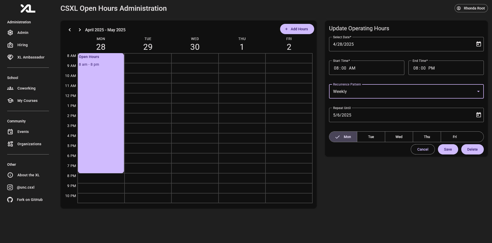
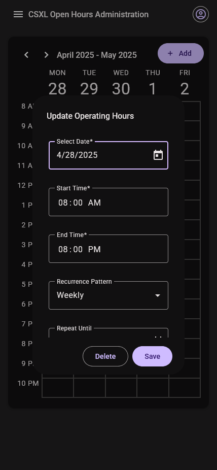

# Academics Feature Technical Specification

> [David Foss](https://github.com/fossinating), [Ella Gonzales](https://github.com/ellagonzales), [Tobenna Okoli](https://github.com/TJOKOLI17), [Francine Wei](https://github.com/francinew6)   > _Last Updated: 05/03/2025_

This document outlines the technical specifications for the Operating Hours Editor feature of the CSXL web application. This feature adds functionality to manage operating hours directly through a user-friendly interface, improving administrative efficiency. The project introduces several new frontend components and utilizes existing API routes with minimal modifications to achieve its goals.

## Table of Contents

- [Frontend Features](#FrontendFeatures)
  - [User Features](#UserFeatures)
    - [Operating Hours Calendar](#OperatingHoursCalendar)
  - [Admin Features](#AdminFeatures)
    - [Calendar View](#CalendarView)
    - [Add Hours View](#AddHoursView)
    - [Edit Hours View](#EditHoursView)
    - [Mobile Editor Dialog](#MobileEditorDialog)
  - [Conclusion](#Conclusion)
- [Backend Design and Implementation](#BackendDesignandImplementation)
  - [Entity Design](#EntityDesign)
  - [Pydantic Model Implementation](#PydanticModelImplementation)
  - [API Implementation](#APIImplementation)
  - [Permission Summary](#PermissionSummary)
  - [Testing](#Testing)
- [Design Choices](#DesignChoices)
  - [Technical Design Choices](#TechnicalDesignChoices)
  - [User Experience Design Choices](#UXDesign)
  - [Design Trade-Offs](#TradeOffs)
- [Future Considerations](#FutureConsiderations)

## Frontend Features

The frontend features add _7_ new Angular components.

### User Features

The following feature has been added and is available for all users of the CSXL site. This feature is ultimately powered by new Angular service functions connected to new backend APIs.

#### Operating Hours Calendar

A new display for operating hours is available from the home and coworking pages from the "All Hours" page. Users can navigate between weeks to see past and future operating hours.

### Admin Features

The admin features can be broken down into four elements: the calendar view, add hours menu, edit hours menu, and mobile dialog.

#### Calendar View

The calendar view allows admins to see the currently scheduled operating hours for past, current, and future weeks, just as public users can.

To implement this, we use the new `Calendar` component to present the operating hours in a human-readable format.

The calendar feature can easily be added throughout the CSXL application. For now, the functionality is only used for operating hours.

#### Add Hours View

Once the admin presses the Add Hours button, a new add hours panel opens up with a form inside with everything needed to create a new operating hours.

#### Edit Hours View

Once the admin selects an operating hours block in the calendar view, a panel opens up on the right-hand side allowing them to edit the details of the operating hours block.

#### Mobile Editor Dialog

If the admin is on a mobile device, the add and edit hours views are replaced by a dialog that is more mobile-friendly.

### Conclusion

In total, the following components have been added:

| Name                                      | Route                                                                | Description                                                                                                                                    |
| ----------------------------------------- | -------------------------------------------------------------------- | ---------------------------------------------------------------------------------------------------------------------------------------------- |
| **Coworking Admin**                       | `/coworking/coworking-admin`                                         | Admin-only page enabling operating hours                                                                                                       |
| **Operating Hours Editor**                | `/coworking/coworking-admin/coworking-operating-hours-editor`        | Form with all the necessary fields for creating/updating operating hours.                                                                      |
| **Operating Hours Mobile Dialog**         | `/coworking/coworking-admin/coworking-operating-hours-mobile-dialog` | Dialog container for the editor form designed for use on mobile devices.                                                                       |
| **Modify Recurrence Confirmation Dialog** | `/coworking/coworking-admin/recurring-hours-modify-confirm-dialog`   | Confirmation dialog used when modifying an operating hour with recurrence in a way that must modify the recurring events.                      |
| **Modify Recurring Selection Dialog**     | `/coworking/coworking-admin/recurring-hours-modify-dialog`           | Selection dialog used when modifying an operating hour with recurrence, allowing user to select whether or not to modify the recurring events. |
| **Calendar**                              | `/shared/calendar`                                                   | Calendar widget that can be passed various events to be displayed.                                                                             |
| **Operating Hours Calendar**              | `/shared/operating-hours-calendar`                                   | Operating hours calendar widget that automatically pulls in the operating hours for the selected week.                                         |

## Backend Design and Implementation

The Operating Hours Editor feature adds _1_ new database tables and modifies _1_ existing table.

### Entity Design

The Operating Hours Editor feature adds one new database table and entity:

| Table Name                              | Entity                           | Description                    |
| --------------------------------------- | -------------------------------- | ------------------------------ |
| `coworking__operating_hours_recurrence` | `OperatingHoursRecurrenceEntity` | Stores recurrence information. |

OperatingHoursRecurrenceEntity is defined with the following columns:

| Column Name | Type       | Description                                                                                                            |
| ----------- | ---------- | ---------------------------------------------------------------------------------------------------------------------- |
| `id`        | `int`      | Unique ID for each operating hours recurrence.                                                                         |
| `end_date`  | `datetime` | Date on which the recurrence ends, which is not included in recurrence.                                                |
| `recurs_on` | `int`      | Recurrence pattern for the operating hours recurrence, stored as a bitmask in an int. More informtion available below. |

The recurrence pattern is stored as a bitmask in an int, with the 0 bitmask being Monday, following python's datetime standard. Some example patterns are listed below:

| Binary  | Integer | Pattern          |
| ------- | ------- | ---------------- |
| 0000001 | 1       | Monday           |
| 0001001 | 9       | Monday, Thursday |
| 0011111 | 31      | Monday - Friday  |

The feature also modifies the existing `coworking__operating_hours_recurrence` table, adding a `recurrence_id` column of foreign keys to `coworking__operating_hours_recurrence.id`, allowing operating hours to be matched to a recurrence.

### Pydantic Model Implementation

The Pydantic models for operating hours and their recurrences are one-to-one with their entity couterparts.

### API Implementation

The Operating Hours Editor feature adds one new API route to handle updating operating hours. Additionally, the delete route was modified to include a new cascade option, allowing the user to specify whether or not to delete recurrences of the operating hours.

### Permission Summary

All of these API routes call on **backend service functions** to perform these operations. These backend services are protected by permissions. Here is a summary of the permissions for the feature:

| Action                                 | Resource                           | Description                                          |
| -------------------------------------- | ---------------------------------- | ---------------------------------------------------- |
| `"coworking.operating_hours.create"`\* | `"coworking/operating_hours"`      | Gives the user permission to create operating hours. |
| `"coworking.operating_hours.update"`   | `"coworking/operating_hours/{id}"` | Gives the user permission to update operating hours. |
| `"coworking.operating_hours.delete"`\* | `"coworking/operating_hours/{id}"` | Gives the user permission to delete operating hours. |

\*These permissions already existed in the existing solution

### Testing

The Operating Hours Editor feature adds full, thorough testing to every new and modified service function added in the operating hours service. All tests pass, and all services created or modified have 100% test coverage.

## Design Choices

### Technical Design Choices

1. **Recurrence as Generated Hours Connected by ID**:

   - We implemented recurrence by creating the hours at modification-time in order to take advantage of pre-existing systems for getting a schedule and identifying Operating Hours by ID.
   - We considered generating hours when the user requested a schedule based on a collection of recurrences, however we decided against it due to anticipated difficulties selecting hours.

2. **Maintaining Recurrence Connection Over Gaps**

   - We decided to make sure that we maintained existing recurrence relationships between Operating Hours even when hours in the middle get deleted.
   - This was done since the update system had support for gaps in the recurrence and breaking the relationships can harm the user experience.

### User Experience Design Choices

1. **Hidden Panels for Add/Edit Hours**:

   - The Add/Edit actions are handled through a panel that only shows while adding or editing, keeping the main calendar view uncluttered.

2. **Simplified Calendar View**:

   - The calendar normally only displays Monday through Friday and hours from 8 AM to 10 PM, reflecting current CSXL operating hours.

3. **Dynamic Calendar Adjustments**:

   - The calendar adjusts dynamically to display scheduled hours even if they fall outside the typical 8 AM–10 PM range.

4. **Sidebar Editing**:

   - A sidebar was chosen for editing hours, allowing users to see the full calendar while managing operating hours.

5. **Highlighting Selected Hour Blocks**:
   - The selected hour block changes color during editing, providing clear visual feedback to the user.

---

### Design Trade-Offs

#### User Experience Design Trade-Off: Sidebar vs. Persistent Panel

- **Decision**: We implemented a pop-up sidebar for editing instead of a persistent panel.
- **Reasoning**: The sidebar ensures the UI remains uncluttered, while allowing administrators to view the calendar as they manage open hours.
- **Trade-Off**: A persistent panel would have streamlined the workflow slightly but at the cost of reduced calendar visibility.

#### User Experience Design Trade-Off: Sidebar vs. Pop-Up

- **Decision**: We implemented adding and editing as a sidebar instead of a pop-up.
- **Reasoning**: The sidebar leaves the administrator's view of the calendar unobstructed while adding and editing.
- **Trade-Off**: A pop-up would have likely been more mobile-friendly at the cost of reduced calendar visibility.

#### User Experience Design Trade-Off: Add Hours Button vs. Direct Calendar Interaction

- **Decision**: We opted for an "Add Hours" button instead of direct calendar interaction for adding hours.
- **Reasoning**: The button simplifies interactions and prevents accidental scheduling errors.
- **Trade-Off**: While direct calendar interaction would be faster for experienced users, it could confuse new users and increase UI complexity.

#### Technical Design Trade-Off: Generating Recurrence at Modification-Time vs. User Request-Time

- **Decision**: We decided to generate recurring events when the administration creates/updates them instead of when the user requests a schedule.
- **Reasoning**: This simplifies selecting hours and viewing schedules, and the main benefit of request-time generation is unlikely to be used much.
- **Trade-Off**: Creating hours when the user requests a schedule would allow for recurrence without a defined end date, and could in theory reduce storage usage.

## Future Considerations

1. **Direct Calendar Interaction**:

- Enable users to click directly on a day to add hours, complementing the "Add Hours" button.

2. **Historical Rescheduling**:

- Allow admins to copy historical schedules to the present.

3. **Prevent Editing the Past**:

- Prevent admins from editing/deleting hours that have already passed.

4. **Reservation Interaction**:

- Cancel reservations if operating hours are deleted or updated such that the CSXL is no longer open during the reservation.
- If we have notifications of some kind set up, notify users of the cancelation.
