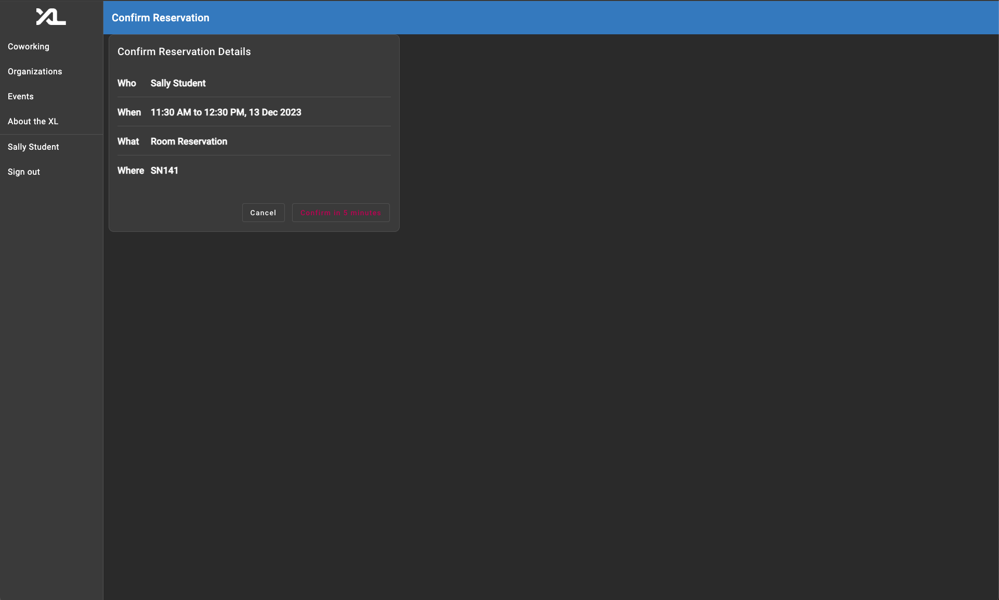

# Room Reservation Technical Specifications

This document contains the technical specifications, including sample data representation of our feature, descriptions of underlying database / entity-level representation decisions and development concerns.

# Authors

- [Aarjav Jain](https://github.com/aarjavjain2002)
- [John Schachte](https://github.com/JohnSchachte)
- [Nick Wherthey](https://github.com/wherthey)
- [Yuvraj Jain](https://github.com/yuvrajjain2003)

# Table of Contents

- [Introduction to Demo](#introduction-to-demo)
  - [How do I reserve a room?](#how-do-i-reserve-a-room)
  - [How do I view my room reservation?](#how-do-i-view-my-room-reservation)
  - [How do I cancel my room reservation](#how-do-i-cancel-my-room-reservation)
- [Description and Sample Data](#descriptions-and-sample-data-representation-of-feature)
  - [0. Room Partial](#0-room-partial)
  - [1. Reservation Request](#1-reservation-request)
  - [2. Reservation Service](#2-reservation-service)
  - [3. Route to get all upcoming reservations for a user.](#3-route-to-get-all-upcoming-reservations-for-a-user)
- [Underlying Database / Entity-Level Representation decisions](#underlying-database--entity-level-representation-decisions)
- [Technical and User Experience Design Choices](#technical-and-user-experience-design-choices)
- [Development Concerns](#development-concerns)
- [For Future Developers](#future-developers)

# Introduction to Demo

This section of the documents contains the instructions to replicate the steps we take in our demo. By reading this, you should be able to replicate how we create room reservations, view upcoming room reservations, and delete room reservations. We would recommend running the `reset_demo` script to populate the backend with some sample reservations to ease the testing process.

## How do I reserve a room?

- From the sidebar, click on Coworking > Room Reservations
- Now you should see a date selector and a table with certain time intervals as columns and room names as rows. To reserve a room, click on **adjacent cells** in a table showing time intervals and room names. You can select up to 4 adjacent slots, equaling a 2-hour reservation. Selecting more than 4 slots resets the selection to one slot. This 2-hour limit is set by a function in the frontend service files and can be adjusted if needed.
- While picking the slots, you will notice a legend with 5 colors. Please bear with us as we figure out more ways to make this accessible to people with color blindness. Currently, the structure is as follows:
  - <span style="color: #03691e"> Available (Green)</span>: These slots are ones which available to be reserved by the user. You can try clicking on one of these slots which will turn into into a "Selected" time slot which will appear orange.
  - <span style="color: red"> Reserved (Red)</span>: These slots are the ones which have been reserved by someone other than you.
  - <span style="color: orange"> Selected (Orange)</span>: These slots represent your selection.
  - <span style="color: #4d4d4d"> Unavailable (Gray)</span>: These slots are unavailble to be reserved because they are either in the past or you have a conflicting reservation in another room or at the CSXL.
  - <span style="color: #3479be"> Your Reservations (Blue)</span>: These slots represent your reservations. You will notice that once you make a reservation, all other time slots in the same column turn gray.


- Once you have picked the slots you like, click on the **Select** button, which will draft a reservation for you, and redirect you to the confirmation page.
- On the confirmation page, you can view the details of your selection including the time, location, and date for your reservation. If you are happy with your selection, click on the **Confirm** button. Otherwise, click on **Cancel**. Note that your reservation draft will automatically be cancelled within 5 minutes if you don't press anything. Navigating out of the page also cancels your reservation.



## How do I view my room reservation?

The natural next question from our previous steps would be, "How do I know that my reservation actually exists?"

Well, our team has come up with a visually succinct way of displaying this information through coworking cards that were already present in the codebase. If you hit confirm, follow the steps below to see your reservations:

- From the sidebar, click on Coworking > Room Reservations.

- Now you should be able to view all your upcoming reservations below the reservation table under the "Upcoming Reservations" header.


- Please note that our upcoming reservations only show reservations to the rooms and not to the Colab CSXL SN156 room, since SN156 currently doesn't accept pre-reservations and only takes walk-ins.

## How do I cancel my room reservation?

- From the sidebar, click on Coworking > Room Reservations.

- On the card for the reservation you want to cancel, simply click on the cancel button. Note that this feature doesn't exist for active reservations, since you are already checked-in. You can instead simply check-out for active reservations.

## Where can I find my active reservations?

- Once you have checked in, the reservation becomes active. The active reservations can be found on the Coworking page.


# Descriptions and Sample Data Representation of feature

We have added / modified the following models / API routes:

## 0. Room Partial

Before:

```py3
class Room(BaseModel):
    id: str
    nickname: str = ""
```

After:

```py3
class RoomPartial(BaseModel):
    id: str | None = None

class Room(RoomPartial):
    nickname: str = ""
```

We had to modify the following class because it felt weird to make a frontend request to draft a reservation and send in the entire `Room` object. This would require the frontend to know both the `id` and the `nickname` for the room that they were trying to book. Instead, we broke up the `Room` class into `Room` and `RoomPartial`, and `ReservationRequest`now uses the `RoomPartial` class instead.

Tl;dr: The frontend now only needs to send in the `id` of the room they want to reserve through the HTTP request.

## 1. Reservation Request

Before:

```py3
class ReservationRequest(TimeRange):
    users: list[UserIdentity] = []
    seats: list[SeatIdentity] = []
```

After:

```py3
class ReservationRequest(TimeRange):
    users: list[UserIdentity] = []
    seats: list[SeatIdentity] = []
    room: RoomPartial | None = None
```

The model did not account for different rooms when making a ReservationRequest. And all reservation requests were hardcoded to make reservations for the CSXL Colab. But, now we have extended this feature to make reservations for any room the user wants.

## 2. Reservation Service

We had to modify the `draft_reservation()` method inside the ReservationService because previously the service would only cater to reservation requests to the XL since the room parameter was hardcoded to be None. We have laxed this condition, and instead feed the room paramater the input we get from the frontend as a FastAPI parameter in `backend/api/coworking/reservation.py`.

We added the following methods into the registration_service file. For sake of brevity, we will only include the method signatures here, but you can locate the actual implementation in the repo.

```py3
def get_current_reservations_for_user(
    self, subject: User, focus: User, state: ReservationState | None = None
) -> Sequence[Reservation]:
    ...


def _get_active_reservations_for_user(
    self, focus: UserIdentity, time_range: TimeRange
) -> Sequence[Reservation]:
    ...


def _get_active_reservations_for_user_by_state(
    self,
    focus: UserIdentity,
    time_range: TimeRange,
    state: ReservationState,
) -> Sequence[Reservation]:
    ...


def get_map_reserved_times_by_date(
    self, date: datetime, subject: User
) -> dict[str, list[int]]:
    ...


def _idx_calculation(self, time: datetime) -> int:
    ...

def _transform_date_map_for_unavailable(
    self, reserved_date_map: dict[str, list[int]]
) -> None:
    ...

def _query_confirmed_reservations_by_date(
        self, date: datetime
    ) -> Sequence[Reservation]:
    ...
```

If you want a deeper understanding of how these functions works, we recommened reading [this section.](#future-developers)

## 3. Route to get all upcoming reservations for a user

We added the following code into the backend API layer:

```py3
@api.get("/room-reservations/", tags=["Coworking"])
def get_all_reservations_by_state(
    state: ReservationState,
    subject: User = Depends(registered_user),
    reservation_svc: ReservationService = Depends(),
) -> Sequence[Reservation]:
    try:
        return reservation_svc.get_current_reservations_for_user(
            subject=subject, focus=subject, state=state
        )
    except Exception as e:
        raise HTTPException(status_code=404, detail=str(e))

```

We needed a way to view all upcoming reservations for a given user so that we can display this information. So we added the following API route into the codebase.

## 4. Route to get timeslots of all reservations for all users

We needed this endpoint because we needed a way for the user to know which timeslots and rooms have already been booked, so that they could make their selection accordingly. We make sure that we only get the time slots and not any private information like names of users who made the reservations. This is the route we added in the `backend/api/coworking/reservation.py` file.

```py3
@api.get("/room-reservation/", tags=["Coworking"])
def get_reservations_for_rooms_by_date(
    date: datetime,
    subject: User = Depends(registered_user),
    reservation_svc: ReservationService = Depends(),
) -> dict[str, list[int]]:
    """See available rooms for any given day."""
    try:
        return reservation_svc.get_map_reserved_times_by_date(date, subject)
    except Exception as e:
        raise HTTPException(status_code=404, detail=str(e))
```

Note that we had to make a novel method to get this map of reserved times. You can find this implementation under `backend/services/coworking/reservation.py`.

# Underlying Database / Entity-Level Representation decisions

We have not interefered with the way that our underlying database stores the data since the structure still remains the same. We have built upon this structure by making new reservations. We are now utilizing the room column within our database which was earlier set to be only None.

# Technical and User Experience Design Choices

## 1. Cards or Table for viewing upcoming reservation

While implementing the upcoming reservations for the user, our team considered between using a table to view all possible upcoming reservations or using a widget card. The trade-off we considered were that tables were a more efficient way of presenting information, and they provide a more efficient way of searching and modifying data. Widgets are much harder to change inputs for and modify, but they provide a more aesthetic and consistent User Experience.

Our team ended up picking the coworking card widgets to display this information because it was more consistent with how the website is set up right now. It actually ended up providing more modularity than a table than we had anticipated and is actually much easier to manage.

## 2. API Routes for drafting reservations

While implementing the API routes for drafting reservations, our team also considering making a separate endpoint for drafting room reservations which were not for the XL, but this ended up becoming very complicated. In the end, we decided that it is probably for the best to reduce the number of endpoints we have and instead modifying the current endpoint to be more expansive and inclusive so that we can make reservations for room other than the XL.

## 3. List of Reservation Time Ranges or Matrix of Available Time Slots

This is in context to making new reservations as illustrated in our Figma wireframe below.


When making reservations, you can see that some of the slots are marked red. These are possibly other reservations that other people in the XL might have made while Sally is trying to make her reservation. In order to actually get this information from the backend, we were debating whether we want to send back a list of reservation objects from the backend to the frontend or send back a matrix of 0s and 1s to represent time slots that are available vs time slots that are reserved. These are the possible trade-offs we considered.

| List of Reservations                                                                                                                                                                                                                                                                        | Matrix of Numbers                                                                                                                                                                 |
| ------------------------------------------------------------------------------------------------------------------------------------------------------------------------------------------------------------------------------------------------------------------------------------------- | --------------------------------------------------------------------------------------------------------------------------------------------------------------------------------- |
| This would be easier to implement on the backend.                                                                                                                                                                                                                                           | This would be considerably harder to implement on the backend                                                                                                                     |
| This would require then iterating through the list of reservations on the frontend, and it is awkwards to have business logic on the frontend for such an algorthmic process.                                                                                                               | This would make it much easier to implement in the frontend since we can easily iterate over the matix and apply the correct widget depending on what value we see in the matrix. |
| This would be much more hardcoded with less modularity for changes in the future. For example, if we toggle to make a room not reservable anymore in the backend, it would either require making an endpoint connect which is awkward or change the hardcoded values which is also awkward. | This would be much more modular since we can actually fetch the operating hours and currently reservable rooms to dynamically update our matrix with updated values.              |

Based on the above analysis of trade-offs, we decided to actually go with the matrix approach, but we made a slight change to it by making it a Map instead, so that the number of rows and columns are not hardcoded, but rather retrived from the backend operating hours page.

# Development Concerns

We have a few development concerns that we would like to hopefully address in the future:

- There should be a limit on how many rooms a user can reserve i.e how many reservations a user can have at any given time.
- Possibly consider adding group members to a reservation. (Add a button in the card to add a user.)
- Allow for pre-reservations in the XL as well. However this will require some clever thinking as the table cannot be extended to just incorporate SN156.
- There are some issues with how room reservations have been currently integrated with XL drop-in reservations, which make it a little harder for the user to navigate.

# Future Developers

This section is designed for developers interested in enhancing or expanding our features. Our goal is to provide a comprehensive overview that facilitates a smooth development experience. We've organized this guide into two main subsections: Frontend Concerns and Backend Concerns. This division reflects the separation of concerns inherent in the RestAPI architecture. If your focus is on frontend development, we strongly advise a thorough examination of the Frontend section and a cursory review of the Backend section. Conversely, backend developers should primarily focus on the Backend section while also familiarizing themselves with key aspects of the Frontend section. This approach ensures a holistic understanding of our system's architecture and functionalities, aiding in more effective and efficient development.

## Frontend Concerns

The Room Reservation feature introduces 2 components, 2 services, and 2 widgets. Users can access this feature through the coworking tab on the navigation bar. It was important to us to maintain the existing structure while developing an interface for users to book reservations, so future developers have less code to learn.

### Components

The components introduced in this feature are the new-reservation and confirmation-reservation components.

#### New-Reservation Component:

This component holds a table for users to make reservations with. In its view, it is the parent component for the Room Reservation Table and Date Selector widget.
It has access to the table service, which holds the business logic for this component to maintain appropriate barriers. A user may also see their Upcoming Reservations under the reservation table.
We decided to use the Coworking Reservation Card to display an upcoming reservation. Once the user clicks the 'Select' button, the component will navigate the user to the Confirm Reservation Component.
Availability is requested from the backend with the help of the Room Reservation Table Service and the Date Selector widget.

#### Confirm Reservation Component:

This is where a user may inspect the reservation they are about to make. This component uses the Coworking Reservation Card widget to display the reservation to the user. If the user does not confirm the draft reservation, this reservation draft will be cancelled on ng destroy. If either cancel or confirm are clicked, the user will be navigated to the Coworking Home Component.

### Services

The two services introduced are the Room Reservation Service and Reservation Table Service.

#### Room Reservation Service:

The Room Reservation Service extends the Reservation Service by adding 3 methods:

1. getReservationsByState: Retrieves reservations by state.
2. checkin: Checks in a confirmed reservation.
3. deleteRoomReservation: Updates a reservation to a cancelled state.

These methods are used to add and update room reservations with the backend. This service is the primary way of interacting with room reservations in the backend.

#### Reservation Table Service:

The Reservation Table Service holds all the business logic for the Room Reservation Table widget while also enumerating the table's cell states.
This service also has logic for interacting with the backend by making draft reservations and getting room reservations by date.

A large portion of this service is aimed at encapsulating rules for maintaining a legitimate reservation request while users interact with the table. For example, a reservation should not have gaps between the reservation start and end times.

### Widgets

The widgets introduced in this feature are the Room Reservation Table and Date Selector. The Coworking Reservation Card widget was heavily used but was preexisting. These were discussed with how they were used within their parent components above.

#### Room Reservation Table:

A widget that uses a table to encapsulate the availability of room reservations for a specific day.

#### Date Selector:

A widget that uses a material date selector class to emit events to parent components. When a user wants to see room reservation availability for a different day, they will use the Date Selector widget to facilitate this change.

#### Coworking Reservation Card:

This preexisting widget is the method by which reservations are displayed to the user.

## Backend Concerns

For this feature, the backend primarily focuses on identifying available and reserved rooms, and also displays users' reservations. To understand the backend functionality, it's recommended to follow the outlined path where we move top-down i.e, we start at the API layer and move down to the queries that interact with the persistent storage.

### 1. API Layer

We recommend by checking out the code present in `backend/api/coworking/reservation.py`. Since this is the first layer that interacts with the frontend, it is the best to understand how the code is working. In this file we added the following routes:

```py3
@api.get("/room-reservations/", tags=["Coworking"])
def get_all_reservations_by_state(
    state: ReservationState,
    subject: User = Depends(registered_user),
    reservation_svc: ReservationService = Depends(),
) -> Sequence[Reservation]:
    try:
        return reservation_svc.get_current_reservations_for_user(
            subject=subject, focus=subject, state=state
        )
    except Exception as e:
        raise HTTPException(status_code=404, detail=str(e))

@api.get("/room-reservation/", tags=["Coworking"])
def get_reservations_for_rooms_by_date(
    date: datetime,
    subject: User = Depends(registered_user),
    reservation_svc: ReservationService = Depends(),
) -> dict[str, list[int]]:
    """See available rooms for any given day."""
    try:
        return reservation_svc.get_map_reserved_times_by_date(date, subject)
    except Exception as e:
        raise HTTPException(status_code=404, detail=str(e))
```

The `get_all_reservations_by_state()` method takes in a state as an argument and retreives all reservations of that state. To understand what a state is, we recommend checking out the `backend/models/coworking/reservation.py` and look at the class `ReservationState`.

The `get_reservations_for_rooms_by_date` returns a dictionary of lists where the keys i.e the rows represents different rooms and the columns represent 30 minute time slots from 10:00 am to 12:00 pm. We will investigate how this dictionary is made within the next section.

### 2. Reservation Service

A keen reader would observe that within the routes we called the `get_map_reserved_times_by_date()` method. This is what does the majority of the work in the backend, and it is highly recommended to become familiar with this method.

The main function `get_map_reserved_times_by_date()` uses the other 3 methods as helper functions to query through the database and turn that into a dictionary of lists where 0 represents available, 1 represents reserved, 2 represents selected, 3 represents unavailable, and 4 represents subject reservations.

An example of what this dictionary would look like is represented below. This is the exact dictionary that is returned by the backend to the frontend. Index 0 represents the timeslot 10:00 - 10:30 am. Index 1 represents 10:30 am - 11:00 am. And so on...

```py3
{
    "SN135" : [0, 0, 0, 0, 1, 1, 1, 1, 0, 0, 0, 0, 4, 4, 4, 4],
    "SN137" : [0, 0, 1, 1, 1, 1, 0, 0, 1, 1, 1, 1, 3, 3, 3, 3],
    "SN139" : [1, 1, 0, 0, 1, 1, 0, 1, 1, 1, 0, 0, 3, 3, 3, 3],
    "SN141" : [0, 0, 0, 0, 1, 1, 1, 1, 0, 0, 1, 1, 1, 1, 3, 3]
}
```

So you can imagine that some other people have already made reservations for example in SN139 from 10:00 am to 11:00 am and SN141 from 12:00 pm to 2:00 pm. Obviously this list does not contain all the reservations listed above, but hopefully should give you a good understanding how this dictionary works. Also note that the columns which have a 4 all have 3s. This is because if you have a reservation from 4:00 pm to 6:00 pm as in the example above, you cannot make another reservation in the time slot. So those time slots become unavailable to be reserved.

## 3. Models

The only model we really implemented in the backend is the RoomPartial and Room model shown below. But it is recommened to go through the other models including the Reservation and User model that are frequently used through our codebase.

```py3
class RoomPartial(BaseModel):
    id: str | None = None

class Room(RoomPartial):
    nickname: str = ""
```
