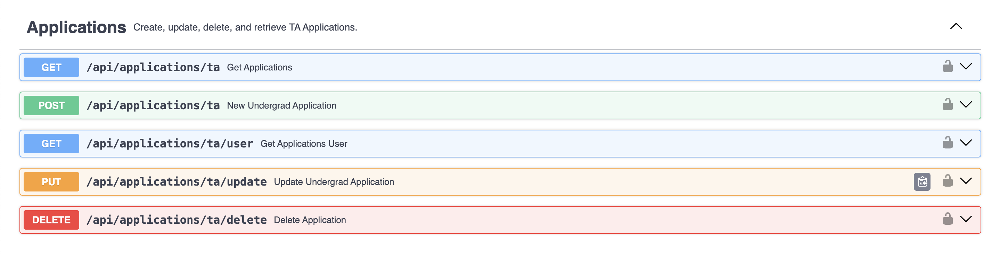

# TA Application Technical Specification

> Written by [Ben Goulet](https://github.com/bwgoulet) for the CSXL Web Application.<br> _Last Updated: 4/26/2024_

This document contains the technical specifications for the TA Application feature of the CSXL web application. This feature adds _2_ new database tables, _5_ new API routes, and _3_ new frontend components to the application.

The TA Application allows us to retrieve data on COMP UTA's via the CSXL web application. The web application can now store data on UNC COMP UTA's, with the eventual implementation of Graduate TA's on the horizon.

All logged-in users to the CSXL page are able to access the _Fall 2024 UTA Application_ to apply to be a UTA. UTA Applications will inevitably be unique per _term_, and are editable upon completion until the end of the application period. Application review is currently not implemented and performed directly via the PostgreSQL database.

## Table of Contents

- [Frontend Features](#FrontendFeatures)
  - [User Features](#UserFeatures)
    - [Academics Home](#AcademicsHome)
    - [UTA Application](#UTAApplication)
    - [Application Home](#ApplicationHome)
  - [Admin Features](#AdminFeatures)
  - [Conclusion](#Conclusion)
- [Backend Design and Implementation](#BackendDesignandImplementation)
  - [Entity Design](#EntityDesign)
  - [Inheritance Mapping](#InheritanceMapping)
  - [Pydantic Model Implementation](#PydanticModelImplementation)
  - [API Implementation](#APIImplementation)
  - [Permission Summary](#PermissionSummary)
  - [Future Considerations](#FutureConsiderations)

## Frontend Features<a name='FrontendFeatures'></a>

The frontend features add _3_ new Angular components, with _2_ of them at the `/ta-application` route.

### User Features<a name='UserFeatures'></a>

The following pages have been added/updated and are available for all logged-in users of the CSXL site. These pages are ultimately powered by new Angular service functions connected to new backend APIs, just like all other features across the CSXL.

#### Academics Home<a name='AcademicsHome'></a>


The home page for the Academics feature now has a card for accessing the _Fall 2024 UTA Application_. When a user clicks 'Apply Now', the following notice pops up:


From here, users can then click 'Apply' to be redirected to the application. Currently, the UTA Notice is its own component with hardcoded information. Ultimately, future developers may want to create a widget for TA Application notices - programatically filling in the HTML based on term data and application periods!

#### UTA Application<a name='UTAApplication'></a>


The UTA application page serves as the portal for the _Fall 2024 UTA Application_. This page contains the bulk of the new TA Application feature, which introduces new frontend elements to the CSXL. Most notably, the entire application is wrapped in a `mat-stepper`, taking the form, of a _form_! For an example of how we set up this form (either with existing data or no data), check out this method for populating the form:

```ts
  populateForm(application: Application | null): void {
    if (application) {
      this.firstFormGroup.patchValue({
        intro_video_url: application.intro_video_url
      });
      this.secondFormGroup.patchValue({
        prior_experience: application.prior_experience,
        service_experience: application.service_experience,
        additional_experience: application.additional_experience
      });
      this.thirdFormGroup.patchValue({
        academic_hours: application.academic_hours,
        extracurriculars: application.extracurriculars,
        expected_graduation: application.expected_graduation,
        program_pursued: application.program_pursued,
        other_programs: application.other_programs
      });
      this.fourthFormGroup.patchValue({
        gpa: application.gpa,
        comp_gpa: application.comp_gpa
      });
      this.fifthFormGroup.patchValue({
        comp_227: application.comp_227
      });

      this.setPreferredSections(application.preferred_sections || []);
      this.selectedSections = application.preferred_sections || [];
    } else {
      this.resetForm();
    }
  }

```

Most of the frontend logic for the TA Application revolves around the process of acquiring this form data, then sending it to our schema in the form that it desires.

#### Application Home<a name='ApplicationHome'></a>


This is the landing page after completing the _Fall 2024 UTA Application_, and is the root route for 'ta-application'.

In the future, when more features related to applications are added, this page will become the home for all things "applications." Currently, this is not the case as admin features and the GTA Application are not yet implemented.

### Admin Features<a name='AdminFeatures'></a>

Admin Features are currently not available for the Fall 2024 application period. Come back here next semester!

### Conclusion<a name='Conclusion'></a>

In total, the following components have been added:

| Name                 | Route                             | Description                                                              |
| -------------------- | --------------------------------- | ------------------------------------------------------------------------ |
| **Application Home** | `/ta-application`                 | Main home page for the applications feature.                             |
| **UTA Application**  | `/ta-application/uta-application` | The UTA Application portal                                               |
| **UTA Notice**       | N/A                               | The pop-up before applying to be a UTA. Will eventually become a widget. |

## Backend Design and Implementation<a name='BackendDesignandImplementation'></a>

The TA Application feature ultimately adds _2_ new database tables and _5_ new API routes.

### Entity Design<a name='EntityDesign'></a>

The TA Application feature adds five new database tables and entities. They are as follows:
| Table Name | Entity | Description |
| --------------------- | ------------------- | --------------------------------------------------------------------- |
| `application` | `ApplicationEntity` | Stores applications. |
| `section_application` | N/A | Stores sections, section preferences, and the associated application. |

The fields and relationships between these entities are shown below:


- [Black]: Current Design
- [Blue]: to-Many relationship
- [Red]: to-One relationship
- [Green]: Not yet implemented

### Inheritance Mapping<a name='InheritanceMapping'></a>

The TA Application is the first feature of the CSXL to utilize a new technique for representing object-oriented hierarchies in our schema - inheritance mapping! This new technique allows us to create a schema that ultimately reflects the hierarchical nature of the TA Application. The inheritance tree for the TA Application is shown below:


Eventually, this will represent the full tree for the TA Applciation. Currently, `Application`, `UTA`, and `New_UTA` have been implemented for the _Fall 2024 UTA Application_. `Returning_UTA` is currently a part of the schema, but there is no use for the subclass this upcoming Fall. This subclass will eventually represent the many returning UTA's in the spring of '25. Finally, everything in green has not yet been implemented - but this half of the tree will represent all Graduate TA's.

As for the _type_ of inheritance mapping the TA Application employs, we're using a **single-table inheritance** structure. This just means that _all classes in a hierarchy are mapped to a single database table_ - `application`.

### Pydantic Model Implementation<a name='PydanticModelImplementation'></a>

The Pydantic models for applications are nearly one-to-one with their entity counterparts, reflecting the inheritance structure from the schema. However, certain application fields require a more custom model structure for handling circular imports, as shown below:

<table>
<tr><th width="520">`Application` and `ApplicationDetails` Models, and their associated children.</th></tr>
<tr>
<td>
 
```py
class Application(BaseModel):
    id: int | None = None
    user_id: int

class UTAApplication(Application):
    academic_hours: int
    extracurriculars: str
    expected_graduation: str
    program_pursued: str
    other_programs: str
    gpa: float
    comp_gpa: float
    comp_227: Comp227

class NewUTAApplication(UTAApplication):
    intro_video_url: str
    prior_experience: str
    service_experience: str
    additional_experience: str

class ReturningUTAApplication(UTAApplication):
    ta_experience: str
    best_moment: str
    desired_improvement: str

class ApplicationDetails(Application):  
    user: User

class UTAApplicationDetails(UTAApplication, ApplicationDetails):
    preferred_sections: list[Section]

```

</td>
</tr>
</table>

### API Implementation<a name='APIImplementation'></a>

The TA Application feature adds 5 new API routes to handle CRUD operations on applications.

Here is a summary of the APIs added:

#### Applications APIs:



### Permission Summary<a name='PermissionSummary'></a>

All of these API routes call on **backend service functions** to perform these operations. These backend services are protected by permissions. Here is a summary of the permissions that this feature added:

| Action                  | Resource              | Description                                                       |
| ----------------------- | --------------------- | ----------------------------------------------------------------- |
| `"applications.create"` | `"applications/{id}"` | Gives the user permission to create applications in the database. |

## Future Considerations<a name='FutureConsiderations'></a>

Here is a list of considerations for future developers, with decresing urgency based on needs for the application.

* Refactor `Application` to have a relationship with `Term`. This will be key for delineating between different applications from the same user.
* Create an admin view for Application selection.
* Move all TA Application features to the new route under `ta-application`. Consider adding a new route to the side-nav.
* Create the schema, models, and frontend form for Graduate TA's
```
