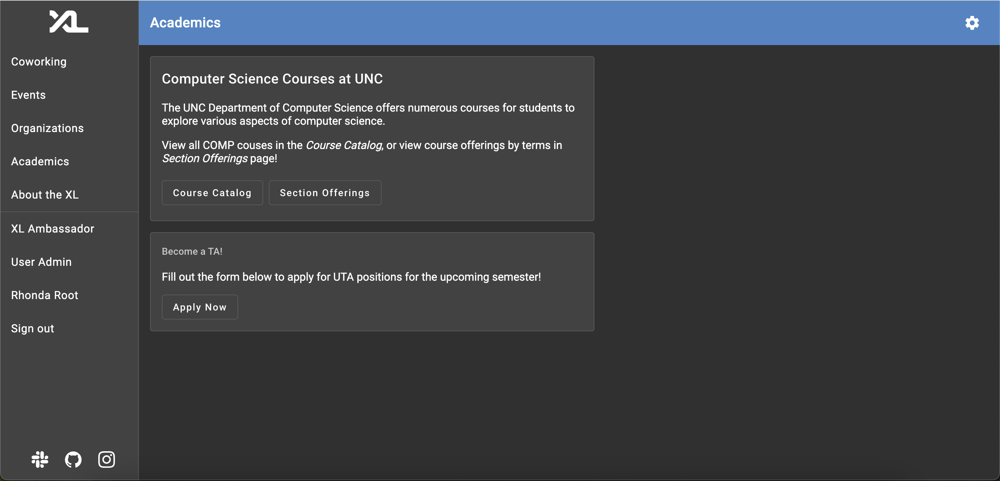
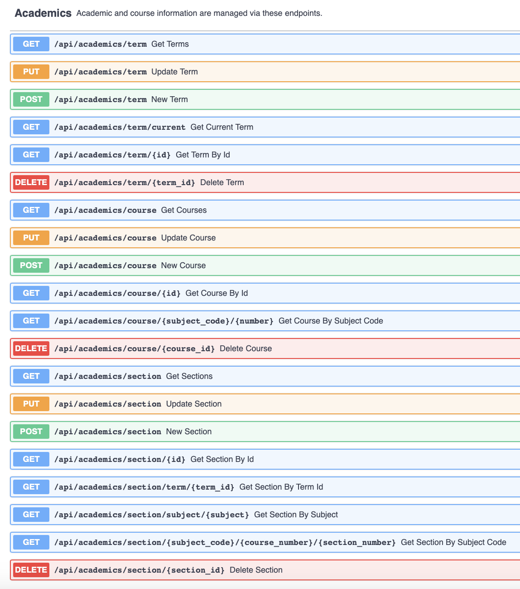

# TA Application Technical Specification

> Written by [Ben Goulet](https://github.com/bwgoulet) for the CSXL Web Application.<br> _Last Updated: 4/24/2024_

This document contains the technical specifications for the TA Application feature of the CSXL web application. This feature adds _2_ new database tables, _5_ new API routes, and _3_ new frontend components to the application.

The TA Application allows us to retrieve data on COMP UTA's via the CSXL web application. The web application can now store data on UNC COMP UTA's, with the eventual implementation of Graduate TA's on the horizon.

All logged-in users to the CSXL page are able to access the _Fall 2024 UTA Application_ to apply to be a UTA. UTA Applications are unique per _term_, and are editable upon completion until the end of the application period. Application review is currently not implemented and performed directly via the PostgreSQL database.

## Table of Contents

- [Frontend Features](#FrontendFeatures)
  - [User Features](#UserFeatures)
    - [Academics Home](#AcademicsHome)
    - [UTA Application](#UTAApplication)
    - [Application Home](#ApplicationHome)
  - [Admin Features](#AdminFeatures)
  - [Conclusion](#Conclusion)
- [Backend Design and Implementation](#BackendDesignandImplementation)
  - [Entity Design](#EntityDesign)
  - [Pydantic Model Implementation](#PydanticModelImplementation)
  - [API Implementation](#APIImplementation)
  - [Permission Summary](#PermissionSummary)
  - [Testing](#Testing)

## Frontend Features<a name='FrontendFeatures'></a>

The frontend features add _3_ new Angular components, with _2_ of them at the `/ta-application` route.

### User Features<a name='UserFeatures'></a>

The following pages have been added/updated and are available for all logged-in users of the CSXL site. These pages are ultimately powered by new Angular service functions connected to new backend APIs, just like all other features across the CSXL.

#### Academics Home<a name='AcademicsHome'></a>



The home page for the Academics feature now has a card for accessing the _Fall 2024 UTA Application_. When a user clicks 'Apply Now', the following notice pops up:


From here, users can then click 'Apply' to be redirected to the application. Currently, the UTA Notice is its own component with hardcoded information. Ultimately, future developers may want to create a widget for TA Application notices - programatically filling in the HTML based on term data and application periods!

#### UTA Application<a name='UTAApplication'></a>


The UTA application page serves as the portal for the _Fall 2024 UTA Application_. This page contains the bulk of the new TA Application feature, which introduces new frontend elements to the CSXL.

#### Application Home<a name='ApplicationHome'></a>


This is the landing page after completing the _Fall 2024 UTA Application_, and is the root route for 'ta-application'.

In the future, when more features related to applications are added, this page will become the home for all things "applications." Currently, this is not the case as admin features and the GTA Application are not implemented.

### Admin Features<a name='AdminFeatures'></a>

Admin Features are currently not available for the Fall 2024 application period. Come back here next semester!

### Conclusion<a name='Conclusion'></a>

In total, the following components have been added:

| Name                 | Route                             | Description                                                              |
| -------------------- | --------------------------------- | ------------------------------------------------------------------------ |
| **Application Home** | `/ta-application`                 | Main home page for the applications feature.                             |
| **UTA Application**  | `/ta-application/uta-application` | The UTA Application portal                                               |
| **UTA Notice**       | N/A                               | The pop-up before applying to be a UTA. Will eventually become a widget. |

## Backend Design and Implementation<a name='BackendDesignandImplementation'></a>

The TA Application feature ultimately adds _2_ new database tables and _5_ new API routes.

### Entity Design<a name='EntityDesign'></a>

The TA Application feature adds five new database tables and entities. They are as follows:

| Table Name            | Entity              | Description                                                           |
| --------------------- | ------------------- | --------------------------------------------------------------------- |
| `application`         | `ApplicationEntity` | Stores applications.                                                  |
| `section_application` | N/A                 | Stores sections, section preferences, and the associated application. |

The fields and relationships between these entities are shown below:


As you can see, the two association tables defined by `SectionUserEntity` and `SectionRoomEntity` relate to (and therefore add relationship fields to) the existing `user` and `room` tables.

### Pydantic Model Implementation<a name='PydanticModelImplementation'></a>

The Pydantic models for terms and courses are nearly one-to-one with their entity counterparts. However, sections utilize a more custom model structure, as shown below:

<table>
<tr><th width="520">`Section` and `SectionDetail` Models</th></tr>
<tr>
<td>
 
```py
# Both models are slightly simplified for better
# comprehensibility here.
class Section(BaseModel):
    id: int | None
    course_id: str
    number: str
    term_id: str
    meeting_pattern: str
    staff: list[SectionMember]
    lecture_room: Room | None
    office_hour_rooms: list[Room]

class SectionDetails(Section):
course: Course
term: Term

```

</td>
</tr>
</table>

As you can see, the room relation is split up into `lecture_room` and `office_hour_rooms` respectively. This helps to simplify frontend logic and prevent numerous filtering calls having to be made. The data is automatically updated in the API.

The user relation is also stripped down to just `staff`, which contains only *instructors* and *TAs* and excludes students. This is done for security purposes. The public GET API should not expose entire student rosters.

### API Implementation<a name='APIImplementation'></a>

The Academics feature adds 25 new API routes to handle CRUD operations on terms, courses, sections, and room data.

Here is a summary of the APIs added:

#### Room APIs:


#### Academics APIs:



### Permission Summary<a name='PermissionSummary'></a>

All of these API routes call on **backend service functions** to perform these operations. These backend services are protected by permissions. Here is a summary of the permissions that this feature added:

| Action | Resource | Description |
| ---- | ---- | -------- |
| `"academics.term.create"` | `"term"` | Gives the user permission to create terms in the database. |
| `"academics.term.update"` | `"term/{id}"` | Gives the user permission to update a term in the database. |
| `"academics.term.delete"` | `"term/{id}"` | Gives the user permission to delete a term in the database. |
| `"academics.course.create"` | `"course"` | Gives the user permission to create courses in the database. |
| `"academics.course.update"` | `"course/{id}"` | Gives the user permission to update a course in the database. |
| `"academics.course.delete"` | `"course/{id}"` | Gives the user permission to delete a course in the database. |
| `"academics.section.create"` | `"section"` | Gives the user permission to create sections in the database. |
| `"academics.section.update"` | `"section/{id}"` | Gives the user permission to update a section in the database. |
| `"academics.section.delete"` | `"section/{id}"` | Gives the user permission to delete a section in the database. |
| `"room.create"` | `"room"` | Gives the user permission to create rooms in the database. |
| `"room.update"` | `"room/{id}"` | Gives the user permission to update a room in the database. |
| `"room.delete"` | `"room/{id}"` | Gives the user permission to delete a room in the database. |

### Testing<a name='Testing'></a>

The Academics feature adds full, thorough testing to every new service function added in the course, section, term, and room services. All tests pass, and all services created or modified have 100% test coverage.

## Future Considerations<a name='FutureConsiderations'></a>

* If we begin to add more course types to the page, I would love to switch the input select for course subject codes to use the material chip components.
* We can now implement the gear icon for other admin features and refactor the folder structure - notably, for organizations.
* We may want a separate `Academics` page specifically for unauthenticated users.
* We can consider creating detail pages for courses and terms. At the moment though, it does not seem necessary.
```
